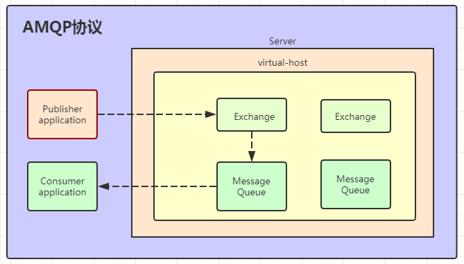
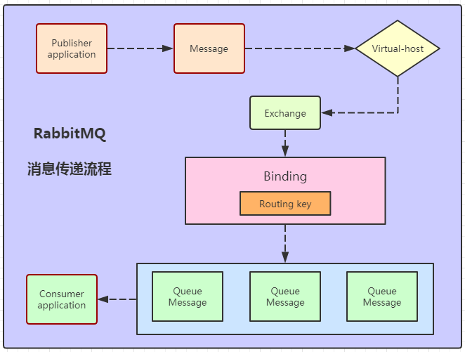

# Springboot2.X 整合RabbitMq 实现消息持久化

## 一、RabbitMQ 简介
官方推出的六种模式
### 1.1 "Hello World!" 

###### 简单模式 一对一生产消费

### 1.2 Work Queues

###### 一个生产者对应多个消费队列
###### 默认情况下，RabbitMQ将按顺序将每条消息发送给下一个消费者。平均而言，每个消费者将获得相同数量的消息

### 1.3 Publish/Subscribe

###### 订阅发布：多个队列订阅一个交换机，每个队列都会接收到自己订阅的交换机

### 1.4 Routing

###### 路由模式：对消息进行过滤，把控消费队列获取消息的信息量

### 1.5 Topics

###### 订阅发布

## 二、AMQP模式

#### RabiitMQ Kafka RocketMQ 性能对比

###### Kafka
Kafka的吞吐量高达17.3w/s，不愧是高吞吐量消息中间件的行业老大。
这主要取决于它的队列模式保证了写磁盘的过程是线性IO。此时broker磁盘IO已达瓶颈。

###### RocketMQ
RocketMQ也表现不俗，吞吐量在11.6w/s，磁盘IO %util已接近100%。
RocketMQ的消息写入内存后即返回ack，由单独的线程专门做刷盘的操作，所有的消息均是顺序写文件。

###### RabbitMQ
RabbitMQ的吞吐量5.95w/s，CPU资源消耗较高。它支持AMQP协议，实现非常重量级，
为了保证消息的可靠性在吞吐量上做了取舍。我们还做了RabbitMQ在消息持久化场景下的性能测试，吞吐量在2.6w/s左右。

#### **测试结论**

###### 在服务端处理同步发送的性能上，Kafka>RocketMQ>RabbitMQ。
###### 测试环境
###### 服务端为单机部署，机器配置如下：

##### 应用版本：

##### 测试脚本

###### 原文链接：https://blog.csdn.net/yunfeng482/article/details/72856762

## 三、MQ应用场景
### 场景说明：
 ### 2.1用户注册后，需要发注册邮件和注册短信,传统的做法有两种
 ###### (1)串行方式:将注册信息写入数据库后,发送注册邮件,再发送注册短信,以上三个任务全部完成后才返回给客户端。
 ###### 这有一个问题是,邮件,短信并不是必须的,它只是一个通知,而这种做法让客户端等待没有必要等待的东西. 
 
###### (2)并行方式:将注册信息写入数据库后,发送邮件的同时,发送短信,以上三个任务完成后,
###### 返回给客户端,并行的方式能提高处理的时间。 
 
###### 假设三个业务节点分别使用50ms,串行方式使用时间150ms,并行使用时间100ms。
###### 虽然并性已经提高的处理时间,但是,前面说过,邮件和短信对我正常的使用网站没有任何影响，
###### 客户端没有必要等着其发送完成才显示注册成功,英爱是写入数据库后就返回.  
###### (3)消息队列 
###### 引入消息队列后，把发送邮件,短信不是必须的业务逻辑异步处理 
 
###### 由此可以看出,引入消息队列后，用户的响应时间就等于写入数据库的时间+写入消息队列的时间(可以忽略不计),引入消息队列后处理后,响应时间是串行的3倍,是并行的2倍。`

### 2.2 应用解耦
场景：双11是购物狂节,用户下单后,订单系统需要通知库存系统,传统的做法就是订单系统调用库存系统的接口. 

###### 这种做法有一个缺点:
    1.当库存系统出现故障时,订单就会失败。
    2.订单系统和库存系统高耦合. `
###### 引入消息队列

###### 订单系统:用户下单后,订单系统完成持久化处理,将消息写入消息队列,返回用户订单下单成功。
###### 库存系统:订阅下单的消息,获取下单消息,进行库操作。 
###### 就算库存系统出现故障,消息队列也能保证消息的可靠投递,不会导致消息丢失。
### 2.3流量削峰
流量削峰一般在秒杀活动中应用广泛 
    场景:秒杀活动，一般会因为流量过大，导致应用挂掉,为了解决这个问题，一般在应用前端加入消息队列。 
###### 作用: 
    1.可以控制活动人数，超过此一定阀值的订单直接丢弃(我为什么秒杀一次都没有成功过呢^^) 
    2.可以缓解短时间的高流量压垮应用(应用程序按自己的最大处理能力获取订单) 
     
###### 1.用户的请求,服务器收到之后,首先写入消息队列,加入消息队列长度超过最大值,则直接抛弃用户请求或跳转到错误页面. 
###### 2.秒杀业务根据消息队列中的请求信息，再做后续处理.
###### 原文链接：https://blog.csdn.net/qq_38455201/article/details/80308771

### 四、RabbitMQ 消息传递流程

2019090914591336.png
## 五、RabbitMQ可靠性投递，防止重复消费设计

原图地址:https://blog.csdn.net/weixin_38937840/article/details/100662457
## SQL 
    案例sql在doc下SQL小的mysqlinit.sql内
## 配置介绍
springamqp介绍[https://docs.spring.io/spring-amqp/docs/1.5.6.RELEASE/reference/html/_reference.html#template-confirms][]
org.springframework.boot.autoconfigure.amqp.RabbitProperties 这里是详细的spring配置
### base
    spring.rabbitmq.host: 服务Host
    spring.rabbitmq.port: 服务端口
    spring.rabbitmq.username: 登陆用户名
    spring.rabbitmq.password: 登陆密码
    spring.rabbitmq.virtual-host: 连接到rabbitMQ的vhost
    spring.rabbitmq.addresses: 指定client连接到的server的地址，多个以逗号分隔(优先取addresses，然后再取host)
    spring.rabbitmq.requested-heartbeat: 指定心跳超时，单位秒，0为不指定；默认60s
    spring.rabbitmq.publisher-confirms: 是否启用【发布确认】
    spring.rabbitmq.publisher-returns: 是否启用【发布返回】
    spring.rabbitmq.connection-timeout: 连接超时，单位毫秒，0表示无穷大，不超时
    spring.rabbitmq.parsed-addresses:
### ssl
    spring.rabbitmq.ssl.enabled: 是否支持ssl
    spring.rabbitmq.ssl.key-store: 指定持有SSL certificate的key store的路径
    spring.rabbitmq.ssl.key-store-password: 指定访问key store的密码
    spring.rabbitmq.ssl.trust-store: 指定持有SSL certificates的Trust store
    spring.rabbitmq.ssl.trust-store-password: 指定访问trust store的密码
    spring.rabbitmq.ssl.algorithm: ssl使用的算法，例如，TLSv1.1
### cache
    spring.rabbitmq.cache.channel.size: 缓存中保持的channel数量
    spring.rabbitmq.cache.channel.checkout-timeout: 当缓存数量被设置时，从缓存中获取一个channel的超时时间，单位毫秒；如果为0，则总是创建一个新channel
    spring.rabbitmq.cache.connection.size: 缓存的连接数，只有是CONNECTION模式时生效
    spring.rabbitmq.cache.connection.mode: 连接工厂缓存模式：CHANNEL 和 CONNECTION
### listener
    spring.rabbitmq.listener.simple.auto-startup: 是否启动时自动启动容器
    spring.rabbitmq.listener.simple.acknowledge-mode: 表示消息确认方式，其有三种配置方式，分别是none、manual和auto；默认auto
    spring.rabbitmq.listener.simple.concurrency: 最小的消费者数量
    spring.rabbitmq.listener.simple.max-concurrency: 最大的消费者数量
    spring.rabbitmq.listener.simple.prefetch: 指定一个请求能处理多少个消息，如果有事务的话，必须大于等于transaction数量.
    spring.rabbitmq.listener.simple.transaction-size: 指定一个事务处理的消息数量，最好是小于等于prefetch的数量.
    spring.rabbitmq.listener.simple.default-requeue-rejected: 决定被拒绝的消息是否重新入队；默认是true（与参数acknowledge-mode有关系）
    spring.rabbitmq.listener.simple.idle-event-interval: 多少长时间发布空闲容器时间，单位毫秒
    
    spring.rabbitmq.listener.simple.retry.enabled: 监听重试是否可用
    spring.rabbitmq.listener.simple.retry.max-attempts: 最大重试次数
    spring.rabbitmq.listener.simple.retry.initial-interval: 第一次和第二次尝试发布或传递消息之间的间隔
    spring.rabbitmq.listener.simple.retry.multiplier: 应用于上一重试间隔的乘数
    spring.rabbitmq.listener.simple.retry.max-interval: 最大重试时间间隔
    spring.rabbitmq.listener.simple.retry.stateless: 重试是有状态or无状态
### template
    spring.rabbitmq.template.mandatory: 启用强制信息；默认false
    spring.rabbitmq.template.receive-timeout: receive() 操作的超时时间
    spring.rabbitmq.template.reply-timeout: sendAndReceive() 操作的超时时间
    spring.rabbitmq.template.retry.enabled: 发送重试是否可用 
    spring.rabbitmq.template.retry.max-attempts: 最大重试次数
    spring.rabbitmq.template.retry.initial-interval: 第一次和第二次尝试发布或传递消息之间的间隔
    spring.rabbitmq.template.retry.multiplier: 应用于上一重试间隔的乘数
    spring.rabbitmq.template.retry.max-interval: 最大重试时间间隔
    
https://docs.spring.io/spring-amqp/docs/1.5.6.RELEASE/reference/html/_reference.html#template-confirms    

###  六、rabbitmq.config配置/性能优化
官网地址: https://www.rabbitmq.com/admin-guide.html

<table width="0" cellspacing="0" cellpadding="0" border="1"><tbody><tr><td>

<strong>Key</strong>

</td>
<td>

<strong>Documentation</strong>

</td>
</tr><tr><td>

tcp_listeners

</td>
<td>

用于监听 AMQP连接的端口列表(无SSL). 可以包含整数 (即"监听所有接口")或者元组如&nbsp;{"127.0.0.1", 5672}&nbsp;用于监听一个或多个接口.

Default:&nbsp;[5672]

</td>
</tr><tr><td>

num_tcp_acceptors

</td>
<td>

接受TCP侦听器连接的Erlang进程数。

Default:&nbsp;10

</td>
</tr><tr><td>

handshake_timeout

</td>
<td>

AMQP 0-8/0-9/0-9-1 handshake (在 socket连接和SSL 握手之后）的最大时间, 毫秒为单位.

Default:&nbsp;10000

</td>
</tr><tr><td>

ssl_listeners

</td>
<td>

如上所述，用于SSL连接。

Default:&nbsp;[]

</td>
</tr><tr><td>

num_ssl_acceptors

</td>
<td>

接受SSL侦听器连接的Erlang进程数。

Default:&nbsp;1

</td>
</tr><tr><td>

ssl_options

</td>
<td>

SSL配置.参考<a href="http://www.rabbitmq.com/ssl.html#enabling-ssl" rel="nofollow" data-token="41125ef0b32cadedea53482adc52d5ae"><strong>SSL documentation</strong></a>.

Default:&nbsp;[]

</td>
</tr><tr><td>

ssl_handshake_timeout

</td>
<td>

SSL handshake超时时间,毫秒为单位.

Default:&nbsp;5000

</td>
</tr><tr><td>

vm_memory_high_watermark

</td>
<td>

流程控制触发的内存阀值．相看<a href="http://www.rabbitmq.com/memory.html" rel="nofollow" data-token="aa924935b83af69a481754ef417ad4af"><strong>memory-based flow control</strong></a>&nbsp;文档.

Default:&nbsp;0.4

</td>
</tr><tr><td>

vm_memory_high_watermark_paging_ratio

</td>
<td>

高水位限制的分数，当达到阀值时，队列中消息消息会转移到磁盘上以释放内存. 
参考<a href="http://www.rabbitmq.com/memory.html" rel="nofollow" data-token="aa924935b83af69a481754ef417ad4af"><strong>memory-based flow control</strong></a>&nbsp;文档.

Default:&nbsp;0.5

</td>
</tr><tr><td>

disk_free_limit

</td>
<td>

RabbitMQ存储数据分区的可用磁盘空间限制．当可用空间值低于阀值时，流程控制将被触发.此值可根据RAM的总大小来相对设置 (如.{mem_relative, 1.0}).此值也可以设为整数(单位为bytes)或者使用数字单位(如．"50MB").默认情况下，可用磁盘空间必须超过50MB.参考&nbsp;<a href="http://www.rabbitmq.com/disk-alarms.html" rel="nofollow" data-token="fa8407d5bc0a613d14eb42e74979f11d"><strong>Disk
 Alarms</strong></a>&nbsp;文档.

Default:&nbsp;50000000

</td>
</tr><tr><td>

log_levels

</td>
<td>

控制日志的粒度.其值是日志事件类别(category)和日志级别(level)成对的列表．

level 可以是 'none' (不记录日志事件), 'error' (只记录错误), 'warning' (只记录错误和警告), 'info' (记录错误，警告和信息), or 'debug' (记录错误，警告，信息以及调试信息).

目前定义了４种日志类别. 它们是：

<ul type="disc"><li style="color:#555555;">channel&nbsp;-针对所有与AMQP channels相关的事件</li><li style="color:#555555;">connection&nbsp;- 针对所有与网络连接相关的事件</li><li style="color:#555555;">federation&nbsp;- 针对所有与<a href="http://www.rabbitmq.com/federation.html" rel="nofollow" data-token="1d033c798c64d7f1679356aaba2c911f"><strong>federation</strong></a>相关的事件</li><li style="color:#555555;">mirroring&nbsp;-针对所有与&nbsp;<a href="http://www.rabbitmq.com/ha.html" rel="nofollow" data-token="6165472749ce5af2fb90f2cdf11e6bba"><strong>mirrored queues</strong></a>相关的事件</li></ul>
Default:&nbsp;[{connection, info}]

</td>
</tr><tr><td>

frame_max

</td>
<td>

与客户端协商的允许最大frame大小. 设置为０表示无限制，但在某些QPid客户端会引发bug. 设置较大的值可以提高吞吐量;设置一个较小的值可能会提高延迟.  

Default:&nbsp;131072

</td>
</tr><tr><td>

channel_max

</td>
<td>

与客户端协商的允许最大chanel大小. 设置为０表示无限制．该数值越大，则broker使用的内存就越高．

Default:&nbsp;0

</td>
</tr><tr><td>

channel_operation_timeout

</td>
<td>

Channel 操作超时时间(毫秒为单位） (内部使用，因为消息协议的区别和限制，不暴露给客户端).

Default:&nbsp;5000

</td>
</tr><tr><td>

heartbeat

</td>
<td>

表示心跳延迟(单位为秒) ，服务器将在connection.tune&nbsp;frame中发送.如果设置为 0, 心跳将被禁用. 客户端可以不用遵循服务器的建议, 查看&nbsp;<a href="http://www.rabbitmq.com/amqp-0-9-1-reference.html#connection.tune" rel="nofollow" data-token="9aec3a8a6aacadd4ef81643018c4f2ee"><strong>AMQP
 reference</strong></a>&nbsp;来了解详情. 禁用心跳可以在有大量连接的场景中提高性能，但可能会造成关闭了非活动连接的网络设备上的连接落下．

Default:&nbsp;60&nbsp;(3.5.5之前的版本是580)

</td>
</tr><tr><td>

default_vhost

</td>
<td>

当RabbitMQ从头开始创建数据库时创建的虚拟主机.&nbsp;amq.rabbitmq.log交换器会存在于这个虚拟主机中.

Default:&nbsp;&lt;&lt;"/"&gt;&gt;

</td>
</tr><tr><td>

default_user

</td>
<td>

RabbitMQ从头开始创建数据库时，创建的用户名.

Default:&nbsp;&lt;&lt;"guest"&gt;&gt;

</td>
</tr><tr><td>

default_pass

</td>
<td>

默认用户的密码.

Default:&nbsp;&lt;&lt;"guest"&gt;&gt;

</td>
</tr><tr><td>

default_user_tags

</td>
<td>

默认用户的Tags.

Default:&nbsp;[administrator]

</td>
</tr><tr><td>

default_permissions

</td>
<td>

创建用户时分配给它的默认<a href="http://www.rabbitmq.com/access-control.html" rel="nofollow" data-token="75f109e334711ff8c56ffa2a30594205"><strong>Permissions</strong></a>&nbsp;.

Default:&nbsp;[&lt;&lt;".*"&gt;&gt;, &lt;&lt;".*"&gt;&gt;, &lt;&lt;".*"&gt;&gt;]

</td>
</tr><tr><td>

loopback_users

</td>
<td>

只能通过环回接口(即localhost)连接broker的用户列表

如果你希望默认的guest用户能远程连接,你必须将其修改为[].

Default:&nbsp;[&lt;&lt;"guest"&gt;&gt;]

</td>
</tr><tr><td>

cluster_nodes

</td>
<td>

当节点第一次启动的时候，设置此选项会导致集群动作自动发生. 
元组的第一个元素是其它节点想与其建立集群的节点. 第二个元素是节点的类型，要么是disc,要么是ram

Default:&nbsp;{[], disc}

</td>
</tr><tr><td>

server_properties

</td>
<td>

连接时向客户端声明的键值对列表

Default:&nbsp;[]

</td>
</tr><tr><td>

collect_statistics

</td>
<td>

统计收集模式。主要与管理插件相关。选项：

<ul type="disc"><li style="color:#555555;">none (不发出统计事件)</li><li style="color:#555555;">coarse (发出每个队列 /每个通道 /每个连接的统计事件)</li><li style="color:#555555;">fine (也发出每个消息统计事件)</li></ul>
你自已可不用修改此选项.

Default:&nbsp;none

</td>
</tr><tr><td>

collect_statistics_interval

</td>
<td>

统计收集时间间隔(毫秒为单位)． 主要针对于&nbsp;<a href="http://www.rabbitmq.com/management.html#statistics-interval" rel="nofollow" data-token="6ba5bb2705548aee6174e7bc22179d27"><strong>management plugin</strong></a>.

Default:&nbsp;5000

</td>
</tr><tr><td>

auth_mechanisms

</td>
<td>

提供给客户端的<a href="http://www.rabbitmq.com/authentication.html" rel="nofollow" data-token="fe76f326db163e629b2a4999c7a2ba35"><strong>SASL authentication mechanisms</strong></a>.

Default:&nbsp;['PLAIN', 'AMQPLAIN']

</td>
</tr><tr><td>

auth_backends

</td>
<td>

用于&nbsp;<a href="http://www.rabbitmq.com/access-control.html" rel="nofollow" data-token="75f109e334711ff8c56ffa2a30594205"><strong>authentication / authorisation backends</strong></a>&nbsp;的列表. 此列表可包含模块的名称(在模块相同的情况下，将同时用于认证来授权)或像{ModN,
 ModZ}这样的元组，在这里ModN将用于认证，ModZ将用于授权.

在２元组的情况中, ModZ可由列表代替,列表中的所有元素必须通过每个授权的确认，如{ModN, [ModZ1, ModZ2]}.这就允许授权插件进行组合提供额外的安全约束.

除rabbit_auth_backend_internal外，其它数据库可以通常&nbsp;<a href="http://www.rabbitmq.com/plugins.html" rel="nofollow" data-token="30b03ce94a13613f797f84778c99533b"><strong>plugins</strong></a>来使用.

Default:&nbsp;[rabbit_auth_backend_internal]

</td>
</tr><tr><td>

reverse_dns_lookups

</td>
<td>

设置为true,可让客户端在连接时让RabbitMQ 执行一个反向DNS查找, 然后通过&nbsp;rabbitmqctl&nbsp;和 管理插件来展现信息.  

Default:&nbsp;false

</td>
</tr><tr><td>

delegate_count

</td>
<td>

内部集群通信中，委派进程的数目. 在一个有非常多核的机器(集群的一部分)上,你可以增加此值.

Default:&nbsp;16

</td>
</tr><tr><td>

trace_vhosts

</td>
<td>

&nbsp;<a href="http://www.rabbitmq.com/firehose.html" rel="nofollow" data-token="024eaa1140cd07d81009925fcbf2d41f"><strong>tracer</strong></a>内部使用.你不应该修改.

Default:&nbsp;[]

</td>
</tr><tr><td>

tcp_listen_options

</td>
<td>

默认socket选项. 你可能不想修改这个选项.

Default:

[{backlog,&nbsp;&nbsp;&nbsp;&nbsp;&nbsp;&nbsp; 128},&nbsp;&nbsp;&nbsp;&nbsp;&nbsp;&nbsp;&nbsp;&nbsp;&nbsp; {nodelay,&nbsp;&nbsp;&nbsp;&nbsp;&nbsp;&nbsp; true},&nbsp;&nbsp;&nbsp;&nbsp;&nbsp;&nbsp;&nbsp;&nbsp;&nbsp; {exit_on_close, false}]

</td>
</tr><tr><td>

hipe_compile

</td>
<td>

将此选项设置为true,将会使用HiPE预编译部分RabbitMQ,Erlang的即时编译器. 
这可以增加服务器吞吐量，但会增加服务器的启动时间． 
你可以看到花费几分钟延迟启动的成本，就可以带来20-50% 更好性能.这些数字与高度依赖于工作负载和硬件．

HiPE 支持可能没有编译进你的Erlang安装中.如果没有的话，启用这个选项,并启动RabbitMQ时，会看到警告消息． 例如, Debian / Ubuntu 用户需要安装erlang-base-hipe&nbsp;包.

HiPE并非在所有平台上都可用,尤其是Windows.

在&nbsp;Erlang/OTP&nbsp;1７.５版本之前，HiPE有明显的问题 . 对于HiPE,使用最新的OTP版本是高度推荐的．

Default:&nbsp;false

</td>
</tr><tr><td>

cluster_partition_handling

</td>
<td>

如何处理网络分区.可用模式有:

<ul type="disc"><li style="color:#555555;">ignore</li><li style="color:#555555;">pause_minority</li><li style="color:#555555;">{pause_if_all_down, [nodes], ignore | autoheal}where&nbsp;[nodes]&nbsp;is a list of node names 
(ex:&nbsp;['rabbit@node1', 'rabbit@node2'])</li><li style="color:#555555;">autoheal</li></ul>
参考<a href="http://www.rabbitmq.com/partitions.html#automatic-handling" rel="nofollow" data-token="533b5a2a5c519c6616724974ca0142fc"><strong>documentation on partitions</strong></a>&nbsp;来了解更多信息

Default:&nbsp;ignore

</td>
</tr><tr><td>

cluster_keepalive_interval

</td>
<td>

节点向其它节点发送存活消息和频率(毫秒). 注意，这与&nbsp;<strong><a href="http://www.rabbitmq.com/nettick.html" rel="nofollow" data-token="d0fd04f5c390704390e9140afbc8a39c">net_ticktime</a>是不同的</strong>;丢失存活消息不会引起节点掉线

Default:&nbsp;10000

</td>
</tr><tr><td>

queue_index_embed_msgs_below

</td>
<td>

消息大小在此之下的会直接内嵌在队列索引中. 在修改此值时，建议你先阅读　&nbsp;<a href="http://www.rabbitmq.com/persistence-conf.html" rel="nofollow" data-token="06254d7eff8c6821d750d45aa27471a0"><strong>persister tuning</strong></a>&nbsp;文档.

Default:&nbsp;4096

</td>
</tr><tr><td>

msg_store_index_module

</td>
<td>

队列索引的实现模块.&nbsp;在修改此值时，建议你先阅读　&nbsp;<a href="http://www.rabbitmq.com/persistence-conf.html" rel="nofollow" data-token="06254d7eff8c6821d750d45aa27471a0"><strong>persister tuning</strong></a>&nbsp;文档.

Default:&nbsp;rabbit_msg_store_ets_index

</td>
</tr><tr><td>

backing_queue_module

</td>
<td>

队列内容的实现模块. 你可能不想修改此值．

Default:&nbsp;rabbit_variable_queue

</td>
</tr><tr><td>

msg_store_file_size_limit

</td>
<td>

Tunable value for the persister.&nbsp;你几乎肯定不应该改变此值。

Default:&nbsp;16777216

</td>
</tr><tr><td>

mnesia_table_loading_timeout

</td>
<td>

在集群中等待使用Mnesia表可用的超时时间。

Default:&nbsp;30000

</td>
</tr><tr><td>

queue_index_max_&nbsp;journal_entries

</td>
<td>

Tunable value for the persister.&nbsp;你几乎肯定不应该改变此值。

Default:&nbsp;65536

</td>
</tr><tr><td>

queue_master_locator

</td>
<td>

Queue master 位置策略.可用策略有:

<ul type="disc"><li style="color:#555555;">&lt;&lt;"min-masters"&gt;&gt;</li><li style="color:#555555;">&lt;&lt;"client-local"&gt;&gt;</li><li style="color:#555555;">&lt;&lt;"random"&gt;&gt;</li></ul>
查看<a href="http://www.rabbitmq.com/ha.html#queue-master-location" rel="nofollow" data-token="97e0021c0ffd2df6b51a21f2fff63b79"><strong>documentation on queue master location</strong></a>&nbsp;来了解更多信息．

Default:&nbsp;&lt;&lt;"client-local"&gt;&gt;

</td>
</tr></tbody></table>

### 注 Auto
    1. 如果消息成功被消费（成功的意思是在消费的过程中没有抛出异常），则自动确认
    2. 当抛出 AmqpRejectAndDontRequeueException 异常的时候，则消息会被拒绝，且 requeue = false（不重新入队列）
    3. 当抛出 ImmediateAcknowledgeAmqpException 异常，则消费者会被确认
    4. 其他的异常，则消息会被拒绝，且 requeue = true，此时会发生死循环，可以通过 setDefaultRequeueRejected（默认是true）去设置抛弃消息
    5. 如设置成manual手动确认，一定要对消息做出应答，否则rabbit认为当前队列没有消费完成，将不再继续向该队列发送消息。
    6. channel.basicAck(long,boolean); 确认收到消息，消息将被队列移除，false只确认当前consumer一个消息收到，true确认所有consumer获得的消息。
    7. channel.basicNack(long,boolean,boolean); 确认否定消息，第一个boolean表示一个consumer还是所有，第二个boolean表示requeue是否重新回到队列，true重新入队。
    8. channel.basicReject(long,boolean); 拒绝消息，requeue=false 表示不再重新入队，如果配置了死信队列则进入死信队列。
    9. 当消息回滚到消息队列时，这条消息不会回到队列尾部，而是仍是在队列头部，这时消费者会又接收到这条消息，如果想消息进入队尾，须确认消息后再次发送消息。

